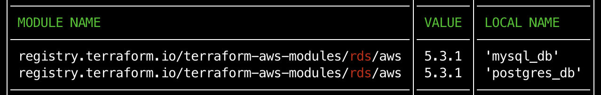

# terraform-modules-used-version

A small utility for getting all your used modules and their
version

## Installation

Install the binary from the `Release` tab and put in into you `PATH`

## Usage

```bash
❯ terraform-modules-used-version --module <module_name>
```

- where `<module_name>` can be `terraform-aws-modules/rds/aws`
  (or `rds` as a shorthand)

example `module` you want to know the used version :

```hcl
module "mysql_db" {
  source = "terraform-aws-modules/rds/aws"
  ...
}
```

example output :



#

## Contributing

Pull requests are welcome. For major changes, please open an issue first
to discuss what you would like to change.

Please make sure to update tests as appropriate.

## License

[MIT](https://choosealicense.com/licenses/mit/)
